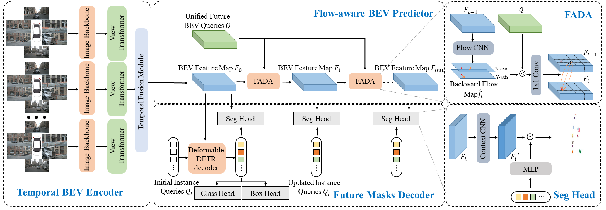

<div align="center">   
  
# FipTR: A Simple yet Effective Transformer Framework for Future Instance Prediction in Autonomous Driving
</div>

> **FipTR: A Simple yet Effective Transformer Framework for Future Instance Prediction in Autonomous Driving**, ECCV 2024
> - [Paper in arXiv](https://arxiv.org/abs/2404.12867)

# Abstract
The future instance prediction from a Bird's Eye View(BEV) perspective is a vital component in autonomous driving, which involves future instance segmentation and instance motion prediction. Existing methods usually rely on a redundant and complex pipeline which requires multiple auxiliary outputs and post-processing procedures. Moreover, estimated errors on each of the auxiliary predictions will lead to degradation of the prediction performance. In this paper, we propose a simple yet effective fully end-to-end framework named Future Instance Prediction Transformer(FipTR),  which views the task as BEV instance segmentation and prediction for future frames. We propose to adopt instance queries representing specific traffic participants to directly estimate the corresponding future occupied masks, and thus get rid of complex post-processing procedures. Besides, we devise a flow-aware BEV predictor for future BEV feature prediction composed of a flow-aware deformable attention that takes backward flow guiding the offset sampling. A novel future instance matching strategy is also proposed to further improve the temporal coherence. Extensive experiments demonstrate the superiority of FipTR and its effectiveness under different temporal BEV encoders.

# News
[2022/7/9]: We release an initial version of FipTR.

# Methods




# Getting Started

## Environment

**a. Create a conda virtual environment and activate it.**
```shell
conda create -n open-mmlab python=3.8 -y
conda activate open-mmlab
```

**b. Install PyTorch and torchvision following the [official instructions](https://pytorch.org/).**
```shell
pip install torch==1.9.1+cu111 torchvision==0.10.1+cu111 torchaudio==0.9.1 -f https://download.pytorch.org/whl/torch_stable.html
# Recommended torch>=1.9

```

**c. Install mmcv-full.**
```shell
pip install mmcv-full==1.4.0
#  pip install mmcv-full==1.4.0 -f https://download.openmmlab.com/mmcv/dist/cu111/torch1.9.0/index.html
```

**d. Install mmdet and mmseg.**
```shell
pip install mmdet==2.14.0
pip install mmsegmentation==0.14.1
```

**e. Install mmdet3d from source code.**
```shell
cd mmdetection3d
python setup.py install
# Warning: mmdetection3d in this repo contains bevpool ops, please do not git clone from original mmdetection3d
```

## Train 

Train FipTR
```
zsh tools/dist_train.sh projects/configs/fiptr_lss_tiny/FipTR_LSS_Tiny.py  8
```
Train FipTR with SyncBN
```
zsh tools/dist_train.sh projects/configs/fiptr_lss_tiny/FipTR_LSS_Tiny_SyncBN.py  8
```
Train FipTR with SyncBN & CBGS
```
zsh tools/dist_train.sh projects/configs/fiptr_lss_tiny/FipTR_LSS_Tiny_CBGS.py  8
```


## Eval
Eval FipTR
```
zsh tools/dist_test.sh config ckpt  8 --eval=bbox
```


# Model Zoo

| Method | IoU(n) | IoU(f) | VPQ(n) | VPQ(f) | Config | Train Time | Download |
| :---:  | :---:  | :---:  | :---:  | :---:  |:---:   | :---:      | :---: | 
| FipTR-T| 59.00 | 36.65 | 53.35 | 33.62 |[config](projects/configs/fiptr_lss_tiny/FipTR_LSS_Tiny.py)  | ~24h / 3090(8) |[download](https://drive.google.com/file/d/1by5SUJJHkN9OvJphEKtemSpKyb5nz8X6/view?usp=drive_link)
| FipTR-T(SyncBN) | 60.33 | 38.20 | 54.04 | 34.31 | [config](projects/configs/fiptr_lss_tiny/FipTR_LSS_Tiny_SyncBN.py) | ~24h / 3090(8) |[download](https://drive.google.com/file/d/1GngoO_nvphznFoeMHv6Vqr5RrZ3-sp86/view?usp=drive_link)
| FipTR-T-CBGS | 60.67 | 38.31 | 55.44 | 36.07 |[config](projects/configs/fiptr_lss_tiny/FipTR_LSS_Tiny_CBGS.py) | ~70h / 3090(8) |[download](https://drive.google.com/file/d/1yMGrkTBP3IR25-AmFHGIxZ_prDi8_0Kd/view?usp=drive_link)


# Bibtex
If this work is helpful for your research, please consider citing the following BibTeX entry.
```
@article{gui2024fiptr,
  title={FipTR: A Simple yet Effective Transformer Framework for Future Instance Prediction in Autonomous Driving},
  author={Gui, Xingtai and Huang, Tengteng and Shao, Haonan and Yao, Haotian and Zhang, Chi},
  journal={arXiv preprint arXiv:2404.12867},
  year={2024}
}
```

# Acknowledgement

Many thanks to these excellent open source projects:
- [mmdet3d](https://github.com/open-mmlab/mmdetection3d)
- [beverse](https://github.com/zhangyp15/BEVerse)
- [bevformer](https://github.com/fundamentalvision/BEVFormer/tree/master)
- [uniad](https://github.com/OpenDriveLab/UniAD)